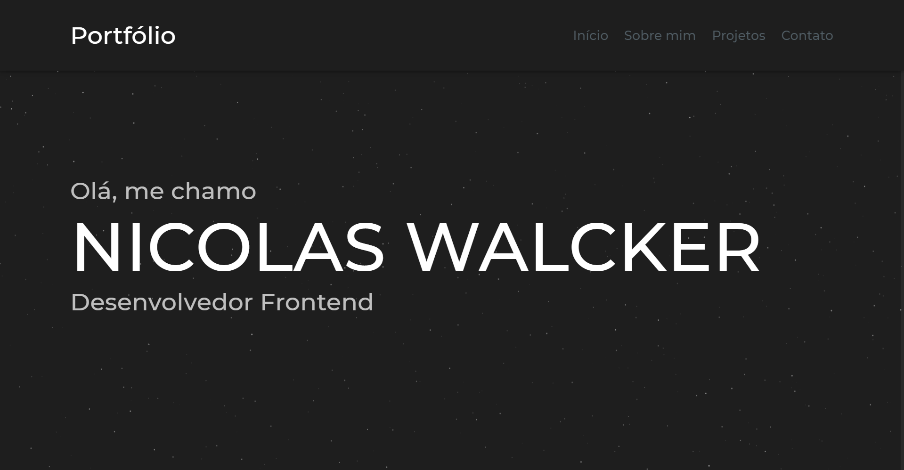

<h1 align="center">
📰 Meu Portfólio
</h1>

<h4 align="center">
Portfólio criado com o intuito de mostrar meus projetos e falar um pouco sobre mim.
</h4>

## 📁 Conteúdo do portfólio

O site é feito de 4 seções:

- **Início**: Nessa seção, temos uma breve apresentação.
- **Sobre mim**: Aqui, temos um card com uma foto minha e uma apresentação de quem sou eu.
- **Projetos**: Aqui é onde coloco meus projetos a mostra. Ees são separados em cards.
- **Rodapé/Contatos**: No rodapé da página, estão meus contatos e minhas redes sociais, aqui também temos um botão para voltar para o topo.

## ⚙️ Tecnologias utilizadas

Para o desenvolvimento deste site utilizei as seguintes tecnologias:

✍️ Layout:
- Figma

⌨️ Código:
- Visual Studio Code
- HTML5
- CSS3
- JavaScript
    - Tilt.js
    - Particles.js

---

## ➕ Ajustes e melhorias
O site ainda está em desenvolvimento e as próximas atualizações serão voltadas nas seguintes tarefas:

- [ ] Responsividade;
- [ ] Light mode (tema claro);
- [ ] Ajustar botão "to the top";;
- [ ] Ajustar scrollbar;

---

## 👨‍💻 Desenvolvido por 
<table>
  <tr>
    <td align="center">
      <a href="https://github.com/nicolaswalcker">
         
        
          <b>Nicolas Walcker</b>
        
      </a>
    </td>
  </tr>
</table>

